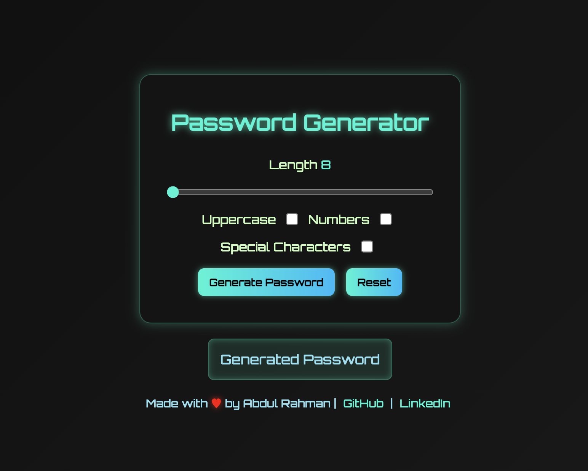
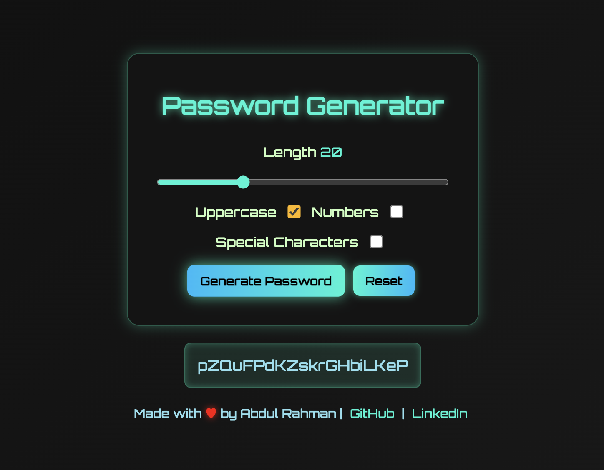
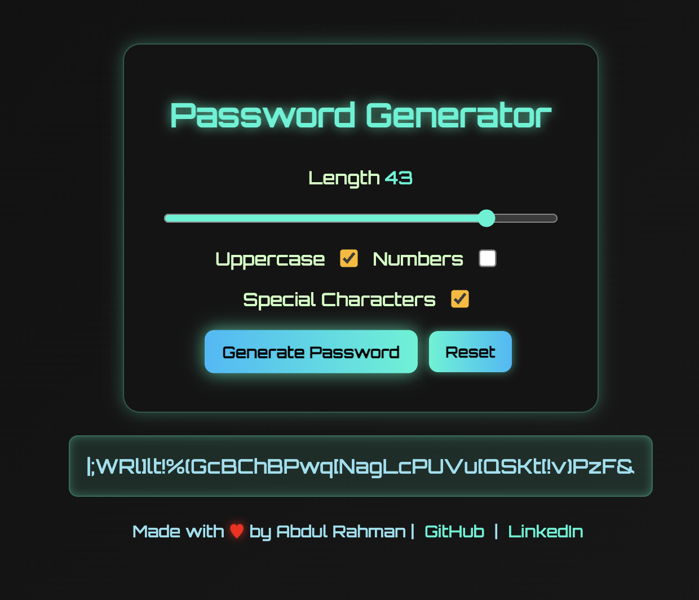

# Password Generator 🔐

A **responsive, tech-styled password generator** built with **HTML, CSS, and JavaScript**, allowing users to create strong passwords with customizable options like uppercase letters, numbers, and special characters.

Access this website here : https://abdul-rahman18.github.io/Password-Generator/

## Features
- Adjustable password length (8–50 characters)
- Options to include:
  - Uppercase letters
  - Numbers
  - Special characters
- Real-time length indicator
- One-click password generation & reset
- Futuristic UI with neon glow styling
- Responsive design for mobile and desktop
- Footer with GitHub & LinkedIn links

## Tech Stack
- **HTML5** – Structure of the web page
- **CSS3** – Styling with a futuristic theme and responsive design
- **JavaScript (Vanilla)** – Password generation logic and interactivity

## Final Output : 

